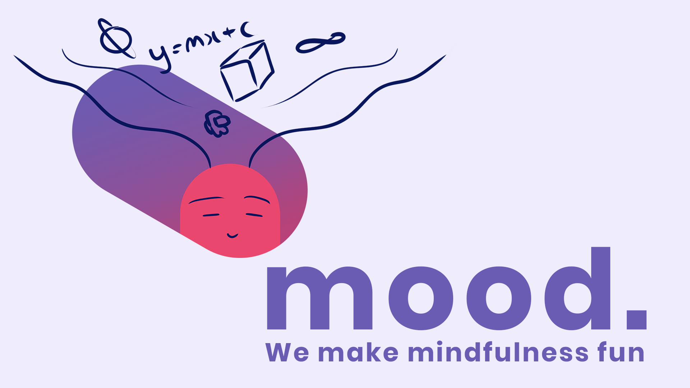

<h1 style="text-align: center; font-weight: bold; font-size: 2rem">mood.</h1>

 

  <a href="https://moodmindfulness.netlify.app/"><strong>https://moodmindfulness.netlify.app/</strong></a>
   

 

## Inspiration

Our team was inspired by improving the health and wellbeing of those who work or study from home.

## What it does

The mood. web application offers an unpaid solution to these problems through guided stretches and meditation, giving users a well-deserved break from their hectic work schedules. We provide a light-hearted, humorous twist to wellness, through relatable themes of the struggles of the typical “work-at-home” employee in an all-in-one mind hub.

## How we built it

mood. is a web application built on a React front-end (+ TypeScript, styled-components etc.). The designs were wireframed on Figma. Our UX designer drew our amazing illustrations on Sketchbook and Photoshop.

## Challenges we ran into

Some specific challenges our team faced included the responsiveness of both mobile and desktop formats, and adapting to new platforms such as Figma.

## Accomplishments that we're proud of

Bryan “The Rock” Wongson is most proud of how well everyone communicated, supported one another and worked together, despite the challenges in implementation and time constraints.

## What we learned

Through this experience, we learned the importance of relying on each other's strengths, and managing scope and expectations iteratively. We also pushed our technical knowledge in learning how to use new front-end libraries, new technologies, and in building new types of components.

What's next for mood. by Bryan 'The Rock' Wongson
We would love to continue building upon this application because we truly believe in the importance of self-care and just enjoying life!

 

## Getting started

1. Clone the repository: `git clone https://github.com/bryanwyk/MOOD.git`
2. Install the dependencies: `yarn install`
3. Run the application: `yarn start`
